[nimaldanyathk.dev](https://nimaldanyathk.dev) &nbsp;·&nbsp;
[github](https://github.com/nimaldanyathk) &nbsp;·&nbsp;
[linkedin](https://www.linkedin.com/in/nimaldanyathk/) &nbsp;·&nbsp;
[youtube](https://www.youtube.com/c/LetsDoTech) &nbsp;·&nbsp;
[email](mailto:nimaldanyathkbackup@gmail.com)

> B.Tech Computer Science & Engineering at Amrita Vishwa Vidyapeetham, 
> Coimbatore — third year. Think outside the `{ }`.

I'm a passionate CSE student who loves building innovative projects, learning 
new technologies, and solving real-world problems through code. My interests 
lie in AI, IoT, and creating interactive web experiences.

**[Lunar South Pole Digital Twin](https://nimaldanyathk.dev/projects)** &nbsp;·&nbsp; <samp>python, a* path planning, fuzzy logic, nasa lola</samp> 
A confidence-aware traversability and path-planning framework for autonomous 
rover exploration. Processes NASA LOLA DEM data for terrain, illumination and 
radar coverage, scores reliability with a fuzzy inference system, and runs A\* 
search to minimise navigation risk over the lunar south pole.

**[SparkD](https://github.com/nimaldanyathk/sparkd)** &nbsp;·&nbsp; <samp>embedded c, yolo, iot, esp32-cam</samp> 
Intelligent crowd-monitoring system: an ESP32-CAM running YOLO for real-time 
high-density crowd detection, triggering alerts to authorities — aimed at 
festivals, public gatherings and stampede prevention. Written in C on Arduino.

**[Semicolon](https://github.com/nimaldanyathk/Semicolon-Embedded-C-Project)** &nbsp;·&nbsp; <samp>embedded c, edge impulse, machine learning</samp> 
Assistive device for the visually impaired: an ESP32-CAM doing currency 
detection and object recognition with Edge Impulse and YOLO, with embedded 
audio feedback. Programmed in C on the Arduino IDE.

**[brAIn](https://github.com/nimaldanyathk/brAIn)** &nbsp;·&nbsp; <samp>web, ai, 3d simulation, gamification</samp> 
Interactive STEM learning platform that makes physics, chemistry and maths 
come alive — 3D simulations, AI tutoring and gamification wrapped into one 
engaging experience for students.

**[RepoVerse](https://github.com/nimaldanyathk/repo-verse)** &nbsp;·&nbsp; <samp>svg animation, github api, generative art</samp> 
A cosmic engine that visualises your repositories as planets orbiting a central 
sun — you. Emits an animated SVG to embed in a profile README; the universe at 
the foot of this page is its output.

<!--
  Regenerating this page:
    ascii.svg   python3 scripts/make_banner.py $'NIMAL\nDANYATH K'   (one-off)
    stat SVGs   the "refresh stats" action runs daily; or trigger it manually
                from the Actions tab (workflow_dispatch)
  Swap in a photo portrait later with scripts/make_portrait.py — see its header.
-->
